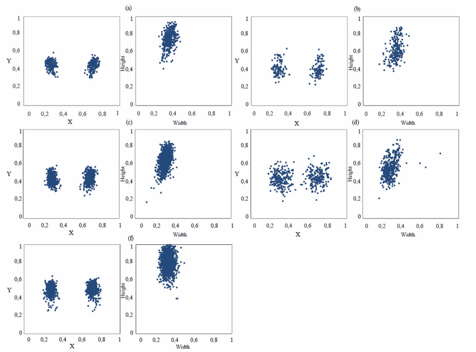

## 简介
- 开个新章节，这里记录Sam+YOLO方法的一些论文。
- 工作需要，看了一些这方面的论文，但是这些方法说实话都是狗尾续貂，创新点不那么可靠。
- 但是看了终归要总结一下，方便后面进行写作。
- 我的目标是实现具有高泛化性的缺陷分割模型，YOLO具有快速检测的优点，在工业场景中应用比较广泛；而SAM号称Segment Anything，无需任何训练就能够适应大部分的场景。
- 我的应用场景是半导体的缺陷检测，SAM并没有这方面的预训练数据，所以直接使用效果不佳，YOLO也有同样的问题，虽然快速，但是预测失效（**要验证**）。

## 文献列表
- [简介](#简介)
- [文献列表](#文献列表)
- [分文章介绍](#分文章介绍)
  - [Automatic Lung Segmentation in Chest X-Ray Images Using SAM With Prompts From YOLO](#automatic-lung-segmentation-in-chest-x-ray-images-using-sam-with-prompts-from-yolo)
  - [Intraoperative Glioma Segmentation with YOLO + SAM for Improved Accuracy in Tumor Resection](#intraoperative-glioma-segmentation-with-yolo--sam-for-improved-accuracy-in-tumor-resection)
  - [Multi Kernel Estimation based Object Segmentation](#multi-kernel-estimation-based-object-segmentation)
## 分文章介绍

### Automatic Lung Segmentation in Chest X-Ray Images Using SAM With Prompts From YOLO
- 期刊：IEEE ACCESS
- 日期：2024.9
- 作者：西班牙 加迪斯大学
- 摘要：尽管当前深度学习模型在医学成像领域的表现令人印象深刻，但将X射线图像中的肺部分割任务转移到临床实践中仍然是一项悬而未决的任务。在这项研究中，对胸部X射线图像中肺野分割的全自动框架的性能进行了评估。该框架植根于具有提示功能的Segment Anything模型（SAM）和提供有效提示的You Only Look Once（YOLO）模型的组合。对迁移学习、损失函数和几种验证策略进行了全面评估。这提供了一个完整的基准，使未来的研究能够公平地比较新的细分策略。所取得的结果表明，对传感器、人群、疾病表现、设备处理和成像条件的可变性具有显著的鲁棒性和泛化能力。所提出的框架在计算上是高效的，可以解决多个数据集训练中的偏见，并有可能应用于其他领域和模式。
- 主要贡献：
我们假设，基于识别边界框作为提示，通过隔离特定的感兴趣区域来消除背景噪声和减轻副作用，有可能显著影响模型在不同尺度的数据集之间进行泛化的能力。我们的研究专门探讨了迁移学习方法，并优化了选择最有效提示的过程，以解开提示和结果之间的关系。
（a）基础模型和DL算法的集成。本研究实现了一个将SAM与YOLO模型相结合的全自动框架。这种组合利用了SAM的高性能图像编码器和YOLO的快速功能，提高了不同数据集的分割精度和泛化能力。
（b）利用各种基准数据集。我们使用五个基准数据集评估该框架，其中包括具有不同病理学（如新冠肺炎、肺炎和结核病）的胸部X射线，增强了模型的泛化能力和鲁棒性。
（c）提供公平的基准。该研究报告了高性能指标，证明了在设备、成像条件、人群和疾病表现存在差异的情况下，所提出方法的有效性、鲁棒性和通用性。作为这一全面评估的结果，为未来研究中的公平比较提供了有价值的基准。
（d）解决临床适用性问题。该研究通过关注迁移学习方法和优化选择有效提示的过程来应对临床适用性的挑战。这种方法旨在降低背景噪声并隔离特定的感兴趣区域，显示出在真实临床环境中提高模型性能的潜力。
- 数据
对每个数据集的分割样本进行了分析。右侧的数字表示每个数据集的左右边界框的宽度和高度。X和Y轴值以归一化单位表示。

- 数据增强
1. 使用数据增强方法来训练和验证YOLO模型。包括旋转（±10度）、缩放（±0.05）、平移（随机图像向左、向右、向上或向下移动10%）、从左向右翻转（概率为50%）和HSV颜色空间的扰动（调整高达全色调范围的1.5%、饱和度范围的70%和值范围的40%）。
2. 调整大小，归一化
3. 对比度受限的自适应直方图均衡化CLAHE（Contrast-limited adaptive histogram equalization），增强对比度
4. gamma校正
- 方法

上面是所提出的分割框架的架构。对全分辨率肺部放射线照相图像进行预处理，并将其输入You Only Look Once（YOLO）网络，以生成肺野的边界框。预测的边界框用作Segment Anything Model（SAM）模型的提示，该模型接收使用伽马校正和对比度增强（CLAHE）技术构建的堆叠3通道图像作为输入。最后，对SAM网络提供的肺边界进行后处理，以生成最终的分割。
SAM：ViT-Base
- 后处理
SAM模型检测到的ROI经过后处理以生成最终输出。铃木方法涉及通过边界跟踪进行拓扑结构分析，用于从SAM模型提供的预测掩码中删除小的、断开的组件。在此之后，应用开放形态学操作，然后进行闭合操作，以解决假阳性和假阴性预测。这两个操作都使用了3×3的核大小来细化分割结果。
- 验证
很少有研究将不同的验证方法结合起来，全面描述所提出模型的泛化能力。我们的研究应用了四种不同的验证方法，提供了一个严格而公平的测试平台，用于比较新的肺部分割策略的结果。此外，这种方法有助于评估所提出的方法是否在可能影响放射学图像特征的不同数据源、数据分布和病理学中有效地推广。
1. 5折交叉验证
2. 数据集成。使用多个源的数据组成实验数据。
3. 跨数据集验证，不同的数据集分别作为训练和测试
4. 基于交叉数据集的半自动验证，两个模型都使用人工标记的标签进行训练。
- 讨论
Tabel6和Tabel7有什么差别？
Table6记录了交叉验证的结果：

Table8汇总了所有文献使用的数据集、处理方式以及结果，这里的工作做的很细致。

### Intraoperative Glioma Segmentation with YOLO + SAM for Improved Accuracy in Tumor Resection
- 会议： NeurIPS 2024 Workshop AIM-FM投稿，Arxiv公开
- 日期：2024.9
- 作者：Algoverse AI Research，中学生（？）
- 摘要：胶质瘤是一种常见的恶性脑肿瘤，由于其与健康组织的相似性，给手术带来了重大挑战。术前磁共振成像（MRI）图像在手术过程中通常无效，因为脑移位等因素会改变脑结构和肿瘤的位置。这使得实时术中MRI（ioMRI）变得至关重要，因为它提供了反映这些变化的最新成像，确保了更准确的肿瘤定位和更安全的切除。本文提出了一种结合You Only Look Once Version 8（YOLOv8）和Segment Anything Model Vision Transformer base（SAM ViT-b）的深度学习管道，以增强ioMRI期间的胶质瘤检测和分割。我们的模型是使用脑瘤分割2021（BraTS 2021）数据集训练的，其中包括标准磁共振成像（MRI）图像和模拟ioMRI图像的噪声分割MRI图像。噪声MRI图像对于深度学习管道来说更难分割，但它们更能代表手术条件。我们的模型实现了0.79的Dice相似度系数（Dice）得分，与在无噪声数据上测试的最先进的分割模型具有相当的性能。这一表现证明了该模型在帮助外科医生最大限度地切除肿瘤和改善手术结果方面的潜力。
- 方法：
  
这个图确实很不美观。
- 训练
YOLO模型不需要对BraTS数据集进行任何训练，因为它已经在BraTS数据集中进行了预训练。为了微调SAM，将YOLO生成的训练集中每个边界框的中间坐标作为初始提示。SAM在10个迭代周期内对这些数据进行了训练。在SAM模型在常规BraTS图像上完成训练后，YOLO和SAM在BraTS图像的增强版本或模拟ioMRI版本上进行训练。

### Multi Kernel Estimation based Object Segmentation